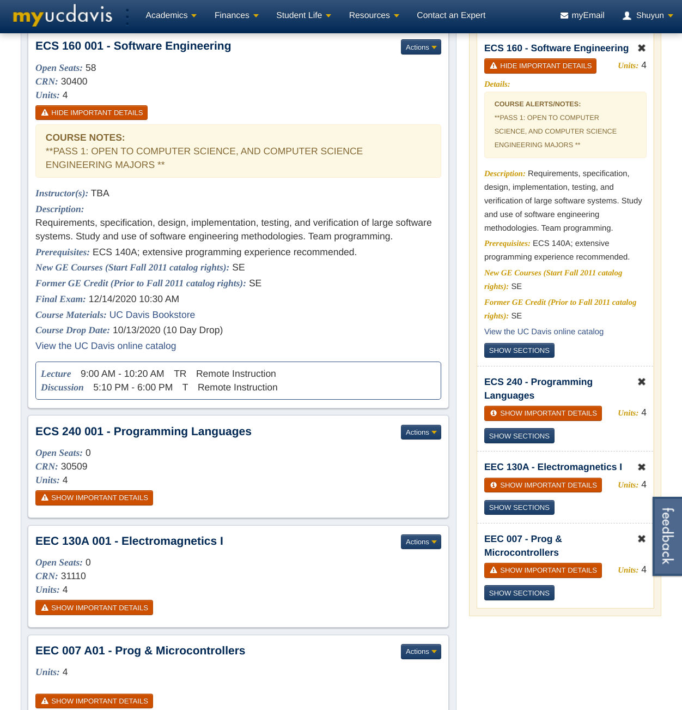
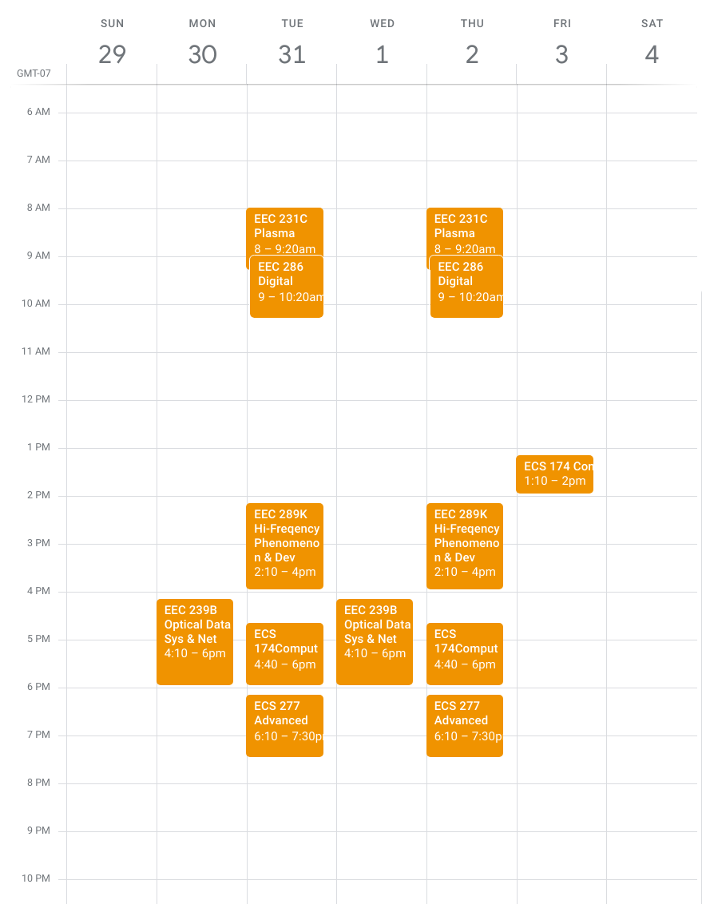

# course2ical
Course Event (RFC5545) Generator

## Description 
Generat RFC5545 calendar events from [UC Davis Schedule Builder](https://students.my.ucdavis.edu/schedulebuilder/index.cfm?termCode=&helpTour=) web page. 

Integrated [```jsoup```](https://jsoup.org/) and [```ical4j```](http://ical4j.github.io/).

## Preview

UC Davis Schedule Builder web page:



Generated iCalendar file (sample):

```ics
BEGIN:VEVENT
DTSTAMP:20200802T061444Z
DTSTART;TZID=America/Los_Angeles:20190327T154000
DTEND;TZID=America/Los_Angeles:20190327T160000
SUMMARY:EEC 130A 001 - Electromagnetics I
UID:97439bd3-2e17-4b99-9859-19c0388b1e14
RRULE:FREQ=WEEKLY;UNTIL=20190606;BYDAY=WE
EXDATE:20190327T154000
ATTENDEE;CN=W. Putnam:mailto:someone@ucdavis.edu
END:VEVENT
BEGIN:VEVENT
DTSTAMP:20200802T061444Z
DTSTART;TZID=America/Los_Angeles:20190327T110000
DTEND;TZID=America/Los_Angeles:20190327T115000
SUMMARY:EEC 007 A01 - Prog & Microcontrollers
UID:8c4c9ea1-c0c4-4403-9ba7-f47feebdfe41
RRULE:FREQ=WEEKLY;UNTIL=20190606;BYDAY=MO
EXDATE:20190327T110000
ATTENDEE;CN=D. Yankelevich:mailto:someone@ucdavis.edu
END:VEVENT
```

Imported calender view:


